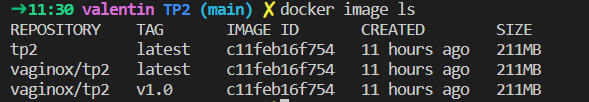

# 8INF876 - TP2
## Introduction
- Étudiant : Valentin THEDON
- Code Permanent : THEV10079801

Ce dépôt contient l'ensemble des sources et livrables pour le choix 1 du TP2.

## Environement

Afin de pouvoir lancer ce projet vous devez disposez de `docker` installé sur votre machine. Si ce n'est pas le cas, merci de vous réferez à la documentation suivante :

- [Docker](https://docs.docker.com/get-docker/)

## Installation
Pour pouvoir lancer l'application, veuillez suivre les étapes suivantes : 
- Ouvrez un terminal
- Assurer vous que le `docker daemon` est bien lancé :
    - Si l'aide de `docker` s'affiche, alors le daemon est bien lancé
    - Dans le cas contraire, référez vous à cette [documentation](https://docs.docker.com/config/daemon/start/). Si la machine est équipée de Windows, vérifiez la bonne installation de [Windows Subsystem for Linux (WSL)](https://learn.microsoft.com/en-us/windows/wsl/about)
- Placez vous, dans la racine de ce projet
- Utiliser la comande suivante : `docker build -t tp2 .`(cf [Explicitation de la commande build](#explicitation-de-la-commande-build))
- Une fois la construction de notre image terminée, nous pouvons lancer la conteneur avec la commande : `docker run --rm -p 80:80 --name test -d tp2` (cf [Explicitation de la commande run](#explicitation-de-la-commande-run))
- Via votre naviguateur favori, tapez `localhost` ou `127.0.0.1` dans la barre de recherche
- Vous devriez être en mesure d'acceder à la page web du TP


## Synchronisation avec Docker Hub
Pour ce faire nous devons, tout d'abord tagger notre image avec notre identifiant [Docker Hub](https://hub.docker.com/). Pour cela nous utilisons les commandes suivantes : 
```
docker image tag tp2 vaginox/tp2:latest
docker image tag tp2 vaginox/tp2:v1.0
```
Nous vérifions les tags de notres images à l'aide le la commande `docker image ls`, ce qui nous donne la sortie suivante : 



Une fois cela réalisé, il nous suffit de nous connecter avec la commande `docker login`. Un fois l'identification éffectué, nous pouvons envoyer nos images sur le registre distant : 
```
docker image push -a vaginox/tp2
```
Enfin si nous souhaiton récupérer l'image depuis le registre, nous pouvons utiliser : `docker pull vaginox/tp2`
## Concept

Pour la réalisation de cete application. Nous avons donc crée un `Dockerfile`, fichier permettant la création d'une image, qui ensuite peut être lancé comme conteneur. Vous retrouvez dans le Dockerfile l'ensemble des explications des commandes.

Par ailleurs, il est important de soulever quelques points clés quant au developpement de cette application.

### Choix de l'image de base
Dans un soucis de simplicité nous avons choisi comme base une image `Debian`, ce qui a pour avantage une utilisation assez répandu et donc une compréhension du plus grand nombre. Cependant, il aurait été possible d'utiliser d'autre base (voire même un base `scratch`), plus lègère, donc plus performante. Je pense notament à une base de distribution `Alpine` qui a comme avantage sa legereté, et sa similarité avec `Debian` (il suffit de comprendre le gestionnaire de paquet `apk`, utilisé par `Alpine`).

### Commande RUN unique VS multiple
Dans notre Dockerfile nous remarquons l'utilisation d'une seule commande `RUN`. En effet, cela est voulu, car le principe de constructions par couche d'une image peut parfois alourdir l'image. Pour illustrer cela, créons un `Dockerfile` assez simple. Le premier aura les 2 commandes `RUN` suivantes :
``` 
RUN fallocate -l 100M /test.file 
RUN rm -f /test.file 
```

Et le second possedera les mêmes commandes mais dans un seul `RUN` : 
```
RUN fallocate -l 100M /test.file && rm -f /test.file 
```
Suite à la construction de ces 2 images, nous observons une différence significative :

Le poids des images est très différents. Effectivement, la multiplication des commandes `RUN` génère tout autant de couches sur l'image, donc si nous supprimons un fichier d'une commande antèrieur, ce dernier aura tout de même été sauvegardé dans l'image final.

Il est donc important, d'éviter la multiplication de ce genre de commande pour ne pas engendrer de trop grosse images inutilement.

### Utilisation de l'option `-y`
Sur les commandes `apt`, nous utilisons l'option `-y` pour éviter les prompts de ces dernières et d'accepter automatiquement les installations. Sans cette option, nous obtenons cette erreur à la construction de l'image car une réponse est attendu : 


### Explicitation de la commande `build`
```
docker build -t tp2 .
```
Cette commande, très simple construit l'image de notre conteneur : 
- l'option `-t` permets de nommer notre image, à noter, qu'il est aussi possible de tagger notre image pour effectuer du versionning

### Explicitation de la commande `run`
```
docker run --rm -p 80:80 --name test -d tp2
```
Cette commande permets de lancer notre conteneur : 
- L'option `--rm` detruit automatiquement l'image orpheline à la fin de son execution
- L'option `-p` permets de mapper les ports de notre conteneur avec celui de notre machine, ici, tout ce qui rentre sur le port 80 de notre machine sera redirigé vers le 80 de notre conteneur
- L'option `--name` donne un nom à notre conteneur
- L'option `-d` détache l'execution de notre conteneur du terminal actuel